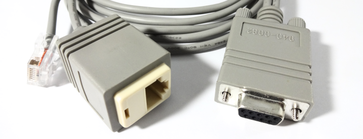

# serialport

Nim bindings for libserialport, the cross-platform serial communication library.




## About

This package contains bindings to *libserialport* for the
[Nim](http://nim-lang.org) programming language. libserialport is a minimal,
cross-platform library for communication with serial ports.


## Supported Platforms

The following platforms have been built and tested with **libserialport 0.2.0**:

- ~~Android~~
- ~~FreeBSD~~
- Linux
- ~~OpenBSD~~
- ~~MacOS X~~
- ~~Windows~~


## Prerequisites

### Android

TODO

### FreeBSD

TODO

### Linux

Your package manager may already have the latest version of *libserialport*
available for installation. Please check the libserialport download page for
details. If the latest library is not available, follow the instructions on the
libserialport wiki to build and install it from source.

Note that on some Linux distributions you may have to copy the generated
*libserialport.so* file into the appropriate location, i.e. to */usr/lib*.

### OpenBSD

TODO

### MacOS X

TODO

### Windows

TODO


## Dependencies

This package does not have any dependencies to other Nim packages at this time.


## Usage

Import the *libserialport* module from this package to make the bindings
available in your project:

```nimrod
import libserialport
```


## Support

Please [file an issue](https://github.com/nimious/serialport/issues), submit
a [pull request](https://github.com/nimious/serialport/pulls?q=is%3Aopen+is%3Apr)
or email us at info@nimio.us if this package is out of date or contains bugs.
For all other issues related to serial port devices visit the libserialport web
site below.


## References

* [libserialport Downloads](http://sigrok.org/wiki/Downloads#Binaries_and_distribution_packages)
* [libserialport Wiki](http://sigrok.org/wiki/Libserialport)
* [Nim Programming Language](http://nim-lang.org/)
